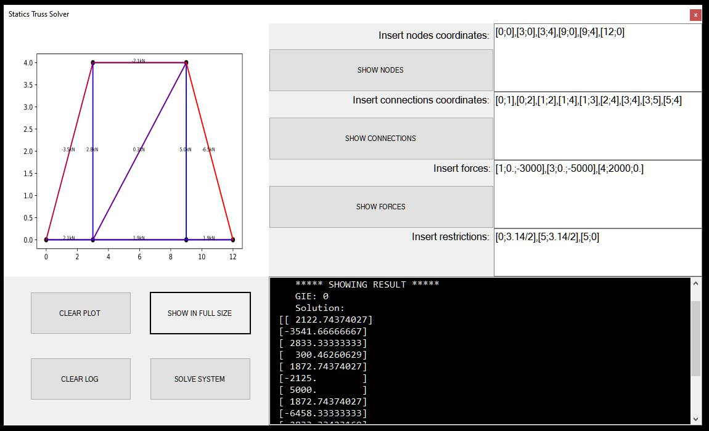
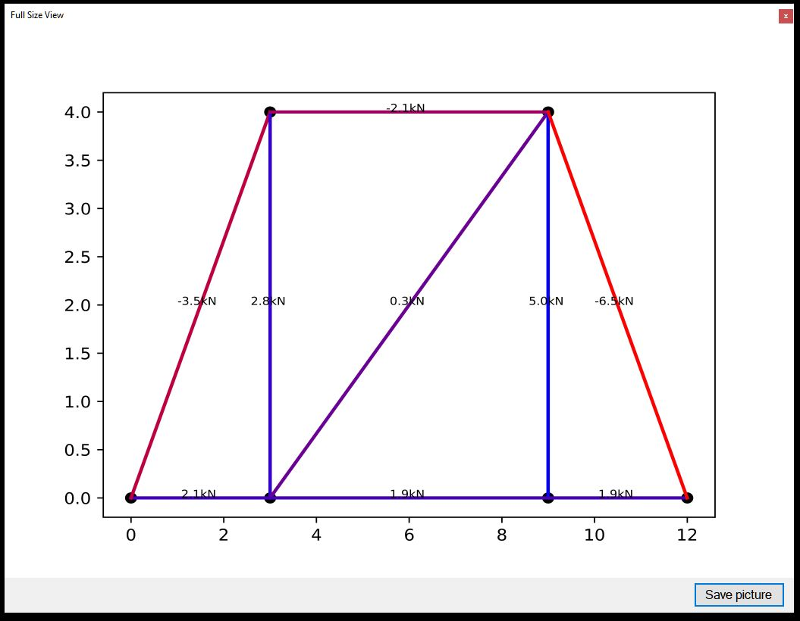
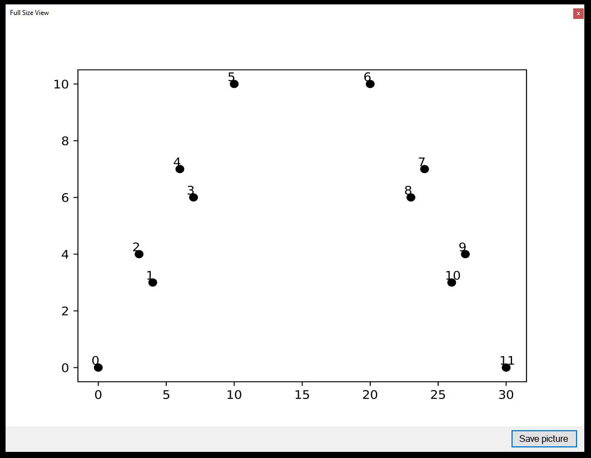
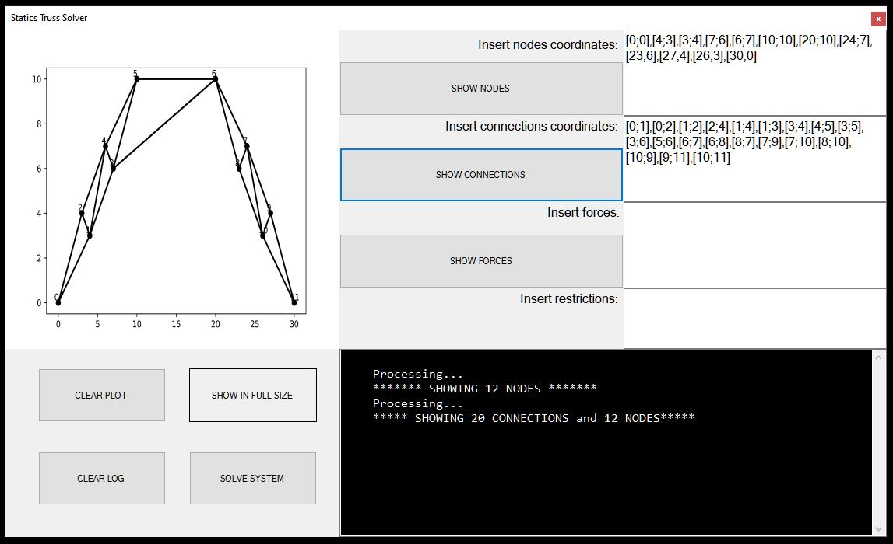
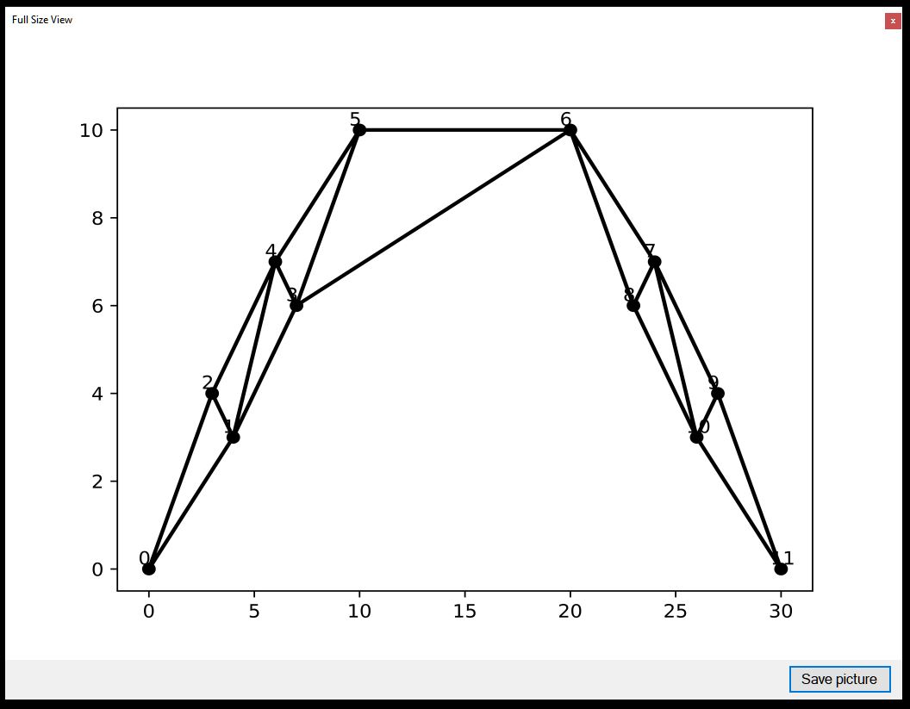
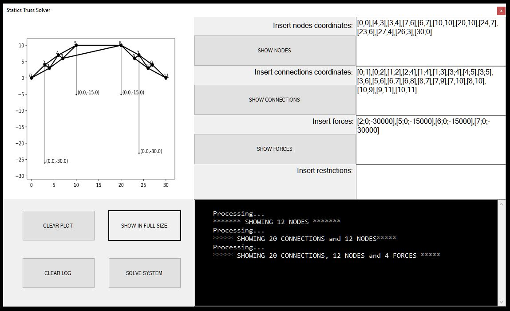

# Statics Truss Solver

## A program to solves Statics Truss Problems

A program that solves Statics Truss Problems, made with a mix of C# (used for GUI) and Python (used to solve the problems and graphing the result). With this program, you will be able to **save the problem solution graph and the nodes, connections and forces** in a very high resolution.

Program view (solved problem)|  Full size view (solved problem)
:---------------------------:|:--------------------------------:
           |  

As you can see in the previous images, once solved, the program generates a truss plot. Over each bar/connection that forms
the truss prints the net force that is applied over it, and the colors indicates if they are on compression or on traction:

* Red: compression
* Purple-like: between compression and traction
* Blue: traction

Notice that in the console log the program generates a solution vector, which includes all the bars/connections and the
reactions over the truss supports.

## Getting started

1. Download or clone this repository, open the solution on Visual Studio. Then, just run it in any mode (debug or release).
Insert the path to your python interpreter in the dialog, which should have the following form:
```
YourDisk:\and\your\path\python.exe
```
***It is very important to not insert in the path folders which names are separated by space.***
Then, you're ready to go. 

2. Insert the truss nodes coordinates in the first entry box in the following format:
```
[x1;y1],[x2;y2],...,[xn;yn]
```
Example:
```
[0;0],[4;3],[3;4],[7;6],[6;7],[10;10],[20;10],[24;7],[23;6],[27;4],[26;3],[30;0]
```
And click "Show nodes" button. You will see the following:

Program view (nodes)         |  Full size view (nodes)
:---------------------------:|:--------------------------------:
            |  

3. Insert the truss connections in the second entry box in the same format as the nodes. Note that
```
[0;1],[0;2]
```
Means that we are connecting the 0th node with the 1st, and the 0th with the 2nd node, which positions are given by
the nodes entry box positions.
Example:
```
[0;1],[0;2],[1;2],[2;4],[1;4],[1;3],[3;4],[4;5],[3;5],[3;6],[5;6],[6;7],[6;8],[8;7],[7;9],[7;10],[8;10],[10;9],[9;11],[10;11]
```
And click "Show connections" button. You will see the following:

Program view (nodes+connect) |  Full size view (nodes+connect)
:---------------------------:|:--------------------------------:
            |  

4. Insert the external forces acting over the truss, in the third entry box with the following format:
```
[nodeIndex;xComponent;yComponent]
```
Example:
```
[2;0;-30000],[5;0;-15000],[6;0;-15000],[7;0;-30000]
```

Program view (nodes+connect+forces)|Full size view (nodes+connect+forces)
:---------------------------------:|:------------------------------------:
                  |  

## Prerequisites

## What I learned

* C# OOP and to use Visual Studio IDE
* .NET Framework's WinForms
* Using IBM Watson Developer Cloud v3.0 API with Pictures Recognition service
* Edit photos with C#

## Authors

* **Gianfranco Lacasella** - *Initial work* - [glacasellaUANDES](https://github.com/glacasellaUANDES)

## License

This project is licensed under the GNU GENERAL PUBLIC LICENSE- see the [LICENSE.md](LICENSE.md) file for details
